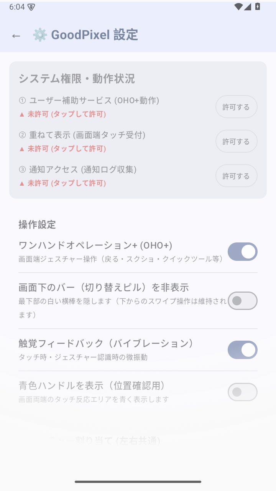
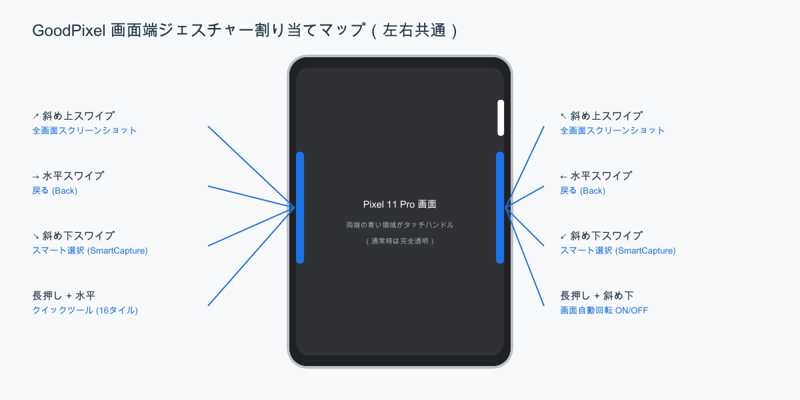
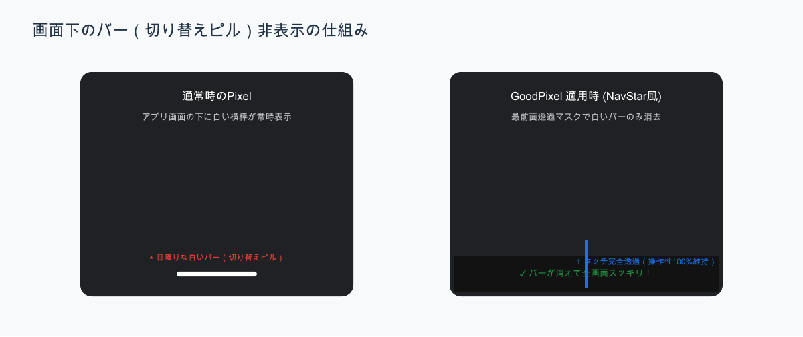
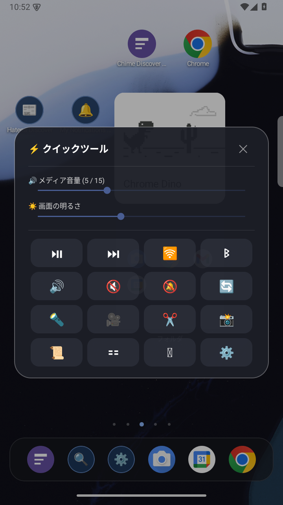
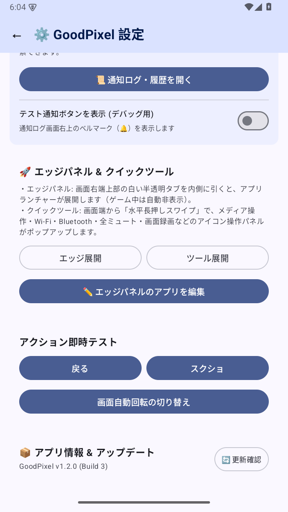

# GoodPixel 操作マニュアル

対象：v1.3.0 / Build 4　作成日：2026年10月6日

GalaxyからGoogle Pixelへ乗り換えた方のための総合操作ガイドです。Good Lock（One Hand Operation +、NavStar、NotiStar、スマート選択、エッジパネル、クイックツール等）の快適な親指操作とマルチタスク体験をPixel上で完全再現するための操作手順・設定方法を詳しく解説します。掲載している画面キャプチャはPixel 11 Pro（Android 16環境）でv1.3.0を実行して撮影したものです。

[PDF版をダウンロード](../output/pdf/20261006_goodpixel-user-manual.pdf) · [READMEへ戻る](../README.md)

---

## 目次

1. [インストールと権限設定](#1-インストールと権限設定)
2. [画面の構成と起動方法](#2-画面の構成と起動方法)
3. [画面端ジェスチャー（One Hand Operation +）](#3-画面端ジェスチャーone-hand-operation-)
4. [画面下のバー（切り替えピル）非表示（NavStar代替）](#4-画面下のバー切り替えピル非表示navstar代替)
5. [スマート選択（SmartCapture / 矩形切り抜き）](#5-スマート選択smartcapture--矩形切り抜き)
6. [エッジパネル（Edge Panel）](#6-エッジパネルedge-panel)
7. [通知ログ機能（NotiLog / 全文検索）](#7-通知ログ機能notilog--全文検索)
8. [クイックツール（Quick Tools）](#8-クイックツールquick-tools)
9. [アプリ内自動アップデート（GitHub Releases 連携）](#9-アプリ内自動アップデートgithub-releases-連携)
10. [困ったときの対処（トラブルシューティング）](#10-困ったときの対処トラブルシューティング)

---

## 1. インストールと権限設定

*図1：GoodPixel の設定画面。システム権限の動作状況と各種操作設定を確認できます。*

### APKのインストール手順

1. 配布元の [GitHub Releases (最新版)](https://github.com/tnk962/GoodPixel/releases/latest) をブラウザで開きます。
2. Assets 一覧から `GoodPixel-v1.3.0.apk` をダウンロードします。
3. ダウンロードしたAPKファイルをタップして開きます。
4. 「提供元不明のアプリのインストール」の許可を求められた場合は、画面の指示に従い、利用したブラウザまたはファイルアプリに対してインストールを許可します。
5. 「インストール」をタップし、完了したら「開く」を押します。

### 必要なシステム権限の設定

GoodPixelは最前面でのタッチ検出やシステムアクション代行、通知収集を行う常駐ユーティリティです。初回起動時に設定画面の「システム権限・動作状況」から以下の3つの主要権限を順番に許可してください。

| 権限項目 | 役割 | 設定手順 |
| :--- | :--- | :--- |
| **① ユーザー補助サービス** | 画面端のスワイプ判定、戻る/スクショの代行、前面アプリ検知 | 「開く」をタップ → 「ダウンロード済みのアプリ」 → 「GoodPixel」をONにする |
| **② 重ねて表示** | 画面端の透明タッチハンドル、エッジパネル、クイックツールの描画 | 「開く」をタップ → 「他のアプリの上に重ねて表示」一覧で「GoodPixel」を許可 |
| **③ 通知アクセス** | 通知ログ機能による通知の自動受信・ローカルデータベース保存 | 「開く」をタップ → 「デバイスとアプリの通知」一覧で「GoodPixel」を許可 |

> **任意権限（追加機能用）**:
> - **システム設定の変更 (`WRITE_SETTINGS`)**: クイックツールやジェスチャーから「画面自動回転」をダイレクトに切り替える際に必要です。初回トグル時に自動でOS許可画面が開きます。
> - **カメラ (`CAMERA`)**: クイックツールの「懐中電灯（フラッシュライト点灯）」機能で使用します。

> [!WARNING]
> ### ⚠️ 【重要・必読】Android 13以降で権限スイッチがグレーアウトする場合
> 
> Google Pixel 7 / 8 / 9 / 10 / 11（Android 13〜16環境）では、セキュリティ保護のためPlayストア外からインストールされたアプリに対して、OS機能**「制限付き設定（Restricted settings）」**が自動適用されます。
> 
> このため、「ユーザー補助」や「通知へのアクセス」を開いた際に**スイッチが薄いグレーになり、タップしても『設定を制限しました』と表示されてONにできない**場合があります。
> 
> **【ブロック解除手順（初回のみ・30秒で完了）】**
> 1. 端末の **「設定」** → **「アプリ」** → **「GoodPixel」**（アプリ情報画面）を開きます。
> 2. 画面右上にある **「︙（3点メニュー）」** をタップします。
> 3. **「制限付き設定を許可」** を選択し、画面ロック（指紋・PIN等）で認証します。
> 4. 再度GoodPixelに戻って権限をタップすると、グレーアウトが解除され正常にONにできるようになります！
> 
> ※ アプリ内の「システム権限・動作状況」または通知ログ画面で **「スイッチが押せない場合」** をタップすると、この「アプリ情報画面」を1タップで直接開くことができます。

---

## 2. 画面の構成と起動方法

### HOME画面からのダイレクト起動
Galaxyで「NotiStar」のショートカットをホーム画面に配置していた使い方を再現するため、ホーム画面の「GoodPixel」アイコンをタップすると、設定画面を挟まずに**直接「通知ログ」画面が瞬時に立ち上がります**。

### 設定画面へのアクセス
通知ログ画面の右上にある **「設定（歯車）」アイコン** をタップすると、いつでも「GoodPixel 設定」画面へ移動できます。ジェスチャーの確認や各種機能のON/OFF、アプリ更新はここから行います。

### App Shortcuts（長押しショートカット）
ホーム画面のGoodPixelアプリアイコンを長押しすると、以下の2つのショートカットメニューが表示されます：
- **通知ログ**: 通知ログ画面を直接開く
- **設定**: GoodPixel 設定画面を直接開く

アイコンを長押ししたままホーム画面の好きな位置へドラッグ＆ドロップすることで、個別のショートカットアイコンとしてホームに常設することも可能です。

---

## 3. 画面端ジェスチャー（One Hand Operation +）

*図2：画面端ジェスチャー割り当てマップ。Pixel 11 Proの両端手元位置から各種アクションを瞬時に実行できます。*

### 画面端ハンドルの特徴
- **最上位レイヤー制御 (`TYPE_ACCESSIBILITY_OVERLAY`)**: Android OS標準の「戻る」矢印ジェスチャーより前面でタッチを掌握するため、誤作動や取りこぼしがありません。
- **手元最適化（スマート幅 48px）**: 親指が自然に届く画面中央〜下寄りに配置。幅をスリム化しているため、Twitter（X）の「共有」や「いいね」ボタンなど端寄りのボタン操作を邪魔しません。
- **タップ透過（パススルー）**: スワイプを伴わない単なるタップ操作は、下のアプリ（Twitter等）へ自動的にクリックが透過送信されます。

### ジェスチャー操作一覧（左右ハンドル共通）

| 操作 | 割り当て機能 | 動作詳細 |
| :--- | :--- | :--- |
| **水平スワイプ (→ / ←)** | **戻る (Back)** | 親指の可動域でどこからでも1手で直前の画面へ戻る |
| **斜め上スワイプ (↗ / ↖)** | **全画面スクリーンショット** | 音量＋電源ボタンを押さずに瞬時に画面をキャプチャ |
| **斜め下スワイプ (↘ / ↙)** | **スマート選択 (SmartCapture)** | 画面をフリーズさせ、必要な範囲を四角く切り抜いて保存 |
| **水平長押しスワイプ** | **クイックツール** | 音量スライダーや各種トグル（16タイル）をポップアップ表示 |
| **斜め下長押しスワイプ** | **画面自動回転 ON/OFF** | 動画閲覧時などに画面回転の自動/固定を即座に切り替え |

### 2段階触覚フィードバック（バイブレーション）
- **スワイプ開始時**: 指を画面端から18px以上動かした瞬間に、微小な「カチッ」という振動が発生。
- **長押し成立時**: 指を端から引き出した状態で **350ms** 保持すると、2回目の「ブルッ」という振動が発生し、長押しアクション（クイックツール等）の受付完了を指先に伝えます。
- 設定画面の「触覚フィードバック」スイッチからON/OFFをいつでも切り替えられます。

### キーボード自動退避 (`moveKeyboard`)
LINEやブラウザでソフトウェアキーボード（Gboard等）が画面下部に展開されると、GoodPixelのタッチハンドルが自動的に**キーボードの上端より上の領域へシフト退避**します。バックスペースキー（⌫）や確定キーの誤爆を物理的に完全防止します。

### ワンハンドオペレーション+ (OHO+) ON/OFF トグル
設定画面の「操作設定」カードにある「ワンハンドオペレーション+ (OHO+)」スイッチをOFFにすると、画面両端のジェスチャーハンドルを即座に停止できます。一時的にジェスチャーを使いたくない場合に便利です。

---

## 4. 画面下のバー（切り替えピル）非表示（NavStar代替）

*図3：画面下の切り替えバー（白い横棒）非表示の仕組み。最前面透過マスクにより操作性を100%維持したまま白いバーを消去します。*

### 機能概要
Google Pixelでは「かこって検索（Circle to Search）」の仕様上、OS標準設定に「ジェスチャーヒント（白い横棒）を非表示にする」項目が用意されていません。GoodPixelではGalaxyのNavStarのように、この白いバーをスッキリ隠す機能を提供します。

### 仕組みと特徴
- **最前面透過マスク方式**: ナビゲーションバー領域（画面最下部・高さ約32dp）に、`FLAG_NOT_TOUCHABLE`（タッチ完全透過）のマスクをオーバーレイ配置します。
- **操作性100%維持**: マスクはタッチイベントを一切遮断しないため、**画面下端からの上スワイプ（ホームに戻る／最近使ったアプリ一覧を開く／アプリ間切り替え）は通常通り完全に滑らかに動作**します。
- **スマート選択連動**: 画面切り抜きキャプチャを実行した瞬間はマスクが自動で一時非表示になり、保存画像に黒帯が写り込みません。

### 設定方法
1. GoodPixel 設定画面を開きます。
2. 「操作設定」カード内の **「画面下のバー（切り替えピル）を非表示」** トグルをONにします（デフォルトはOFF）。

> **アプリの表示領域（Edge-to-Edge）について**:
> - ゲーム（学園アイドルマスター、ブルーアーカイブ等）はアプリ自身が全画面没入モード（Immersive Mode）を要求するため、画面の最下部キワキワまでコンテンツが広がります。
> - 一般のアプリはアプリ自身のレイアウト仕様により下部にマージンが確保される場合がありますが、本機能をONにすることで白いバーのチラつきや目障りな光を完全に排除できます。

---

## 5. スマート選択（SmartCapture / 矩形切り抜き）

Instagramの写真やWeb記事の気になる画像・テキスト領域を、1秒で画像ファイルとして保存できるGalaxy互換ツールです。

### 基本操作手順
1. 保存したい画面で、画面端から **「斜め下スワイプ (↘ / ↙)」** を行います（エッジパネルやクイックツールからも起動可能）。
2. 現在の画面が静止画としてフリーズ展開されます。
3. 切り抜きたい領域を指でドラッグして四角い枠を作ります。
4. 枠の内部をドラッグして**位置を移動**したり、四隅・四辺の丸ハンドルをドラッグして**サイズを微調整**します。
5. 画面下部に表示される **「✓ 写真を保存」** をタップします。
6. 端末の `Pictures/GoodPixel` フォルダへ高画質PNG画像として即時保存されます。右上の「✕」を押すとキャンセルします。

### 画面端マグネティックスナップ
選択枠を画面の端（上下左右）に近づけると、自動的に画面端（0px）へ**カチッと吸着**します。吸着した瞬間に微小なハプティック振動が指先に伝わり、画面端ギリギリの正確な切り抜きがストレスなく行えます。

---

## 6. エッジパネル（Edge Panel）

画面右端のやや上部に常駐する細身の白い半透明タブから、いつでもお気に入りアプリや便利ツールを引き出せるランチャー機能です。

### 基本操作
- **引き出し**: 右端の白いタブを左方向へスワイプすると、スライドインでパネルが展開します。
- **アプリ起動**: 登録されたアプリのアイコンをタップすると即座に起動します。
- **ショートカット**: 最上部のアイコンから「通知ログ」「スマート選択」「クイックツール」へ直接アクセスできます。
- **パネルを閉じる**: パネル外の画面をタップするか、Androidの「戻る」操作で閉じます。

### アプリの追加・並び替え（`EdgeAppPicker`）
パネル内の「＋ 編集」をタップすると、端末内の全インストール済みアプリ（Googleアプリやシステム設定を含む）が一覧表示されます。チェックを入れるだけで最大12個まで自由に追加・削除・並び替えが可能です。

### ゲーム自動非表示機能
学園アイドルマスターやブルーアーカイブ等のゲームアプリを起動すると、GoodPixelが前面アプリのカテゴリを自動検知し、エッジタブを完全に非表示（`GONE`）にします。ゲーム中の誤操作を100%防止します。

---

## 7. 通知ログ機能（NotiLog / 全文検索）

### 特徴（NotiStar完全再現）
- **完全フラット時系列蓄積**: OS標準のようにアプリごとにまとめず、届いた通知を1件ずつ時系列でローカルSQLiteに永続保存します。
- **通知上書き問題の解消 (DB v2)**: Twitter（X）等のアプリが同一通知IDを再利用して新着通知を発行しても、過去の通知が上書き消去されずすべて個別の履歴として残ります。
- **スマート重複抑止**: 直近60秒以内の完全同一内容通知のみを除外し、音楽プレイヤー等の常駐通知によるログ埋め尽くしを防止します。

### 主な機能
1. **インクリメンタル全文検索**: 上部の検索バーに文字を入力すると、アプリ名・タイトル・本文から過去の通知を瞬時に絞り込み検索できます。
2. **ワンタップジャンプ**: 通知カードをタップすると、その通知が届いた該当画面（ツイート詳細やTeamsのメッセージなど）へ直接遷移します。
3. **安心のエッジスワイプ削除**:
   - カードを左右どちらかにスワイプして削除できます。
   - **誤消去防止ロジック**: 画面幅の **75%以上** までしっかり指を持っていった時のみ削除が実行されます。
   - 途中で指を戻したり離した場合は、自動的に元の位置へスナップバック復帰します。
   - 端に到達した瞬間に「カチッ」と微振動が伝わるため、消去のタイミングが直感的に分かります。
4. **一括全消去**: 右上の「ゴミ箱」アイコンをタップすると、確認ダイアログの後に全履歴を一括削除できます。
5. **試験用通知トグル**: 設定画面からテスト用ベルマーク（通知ベル）の表示/非表示を切り替えられます（初期値OFF）。

---

## 8. クイックツール（Quick Tools）

*図4：クイックツール操作パネル。上部にメディア音量・画面の明るさスライダー、下部に親指で押しやすい16個の機能タイルが並びます。*

画面端からの「水平長押しスワイプ」で手元にポップアップするフローティング操作パネルです。

### 16タイルグリッドの機能一覧（4×4構成）
タイルは親指で押しやすい正方形アイコンで構成されています。何の機能か確認したい場合は、**タイルを長押しすると機能名のトーストが表示**されます。

| タイル表示 | 機能名 | 動作詳細 |
| :--- | :--- | :--- |
| [ 再生 / 一時停止 ] | メディア再生制御 | 再生中の音楽・動画をバックグラウンド操作 |
| [ 次の曲 ] | トラック送り | メディアの早送り・次の曲へスキップ |
| [ Wi-Fi ] | Wi-Fi パネル | Wi-Fi接続設定パネルを開く |
| [ Bluetooth ] | Bluetooth パネル | Bluetooth機器接続パネルを開く |
| [ サウンドモード ] | 着信モード切替 | 通常音とバイブレーションを交互に切り替え |
| [ 全ミュート ] | 全消音トグル | すべての通知音・メディア音をワンタップで消音 |
| [ 通知完全オフ ] | サイレントモード | アプリ通知を一時的に一括ブロック（DND） |
| [ 画面自動回転 ] | 自動回転切替 | 画面の自動回転と縦向き固定をワンタップ切り替え |
| [ ライト ] | 懐中電灯 | 背面カメラLEDフラッシュライトの点灯/消灯 |
| [ 画面録画 ] | 画面録画開始 | システム標準の画面録画ダイアログを起動 |
| [ スマート選択 ] | 範囲切り抜き | SmartCaptureの矩形選択エディタを即座に起動 |
| [ スクショ ] | 全面キャプチャ | 画面全体のスクリーンショットを即時実行・保存 |
| [ 通知ログ ] | NotiLog 起動 | 通知ログ蓄積画面を即座に開く |
| [ 画面分割 ] | 分割画面モード | 画面を2分割してマルチタスク表示を開始 |
| [ 電源メニュー ] | 電源ダイアログ | 物理ボタン不要で電源・再起動メニューを表示 |
| [ 設定 ] | GoodPixel 設定 | GoodPixelの詳細設定画面を開く |

### スライダーと閉じる操作
- **メディア音量スライダー**: 音楽や動画の再生音量を手元で直感的に微調整できます。
- **画面の明るさスライダー**: システム設定の画面の明るさを手元でスムーズに調整できます。
- **閉じる操作**: 右上の「✕」ボタンをタップするか、パネル外の領域をタップ、または「戻る」操作で即座に閉じます。

### オートディスミス（自動クローズ）
クイックツールが最前面に居座るのを防ぐため、以下の条件で自動的に安全クローズされます：
- 操作がないまま **8秒経過** した場合
- 端末の画面消灯（スリープ）またはロックが発生した場合
- 背面のアプリが終了・切り替わった場合
- パネル外の領域をタップした場合

---

## 9. アプリ内自動アップデート（GitHub Releases 連携）

*図5：アプリ内アップデート確認画面。最新版の変更点確認からダウンロード・更新までシームレスに完結します。*

GoodPixelはGitHub Releasesと直接連携し、ブラウザでサイトを探しに行かなくてもアプリ内からワンタップで最新版へアップデートできます。

### アップデート手順
1. GoodPixel 設定画面を開きます。
2. 画面最下部の「アプリ情報 & アップデート」カードへ進みます。
3. **「更新確認」** ボタンをタップします。
4. 新しいバージョンがある場合、ダイアログに最新バージョンの詳細と更新内容（Changelog）が表示されます。
5. **「今すぐ更新」** をタップすると、ダウンロードプログレスバーが進み、完了後に自動でAndroidのパッケージインストーラーが起動します。
6. 「更新」をタップすればアップデート完了です。
7. すでに最新版が適用されている場合でも、「再ダウンロード」ボタンから最新APKを取得し直すことが可能です。

---

## 10. 困ったときの対処（トラブルシューティング）

### Q0. 権限設定のスイッチがグレーアウトしてONにできない（「設定を制限しました」と出る）
* **原因**: Android 13以降のセキュリティ仕様「制限付き設定」により、Playストア外アプリの権限変更がOSにより自動ロックされています。
* **対処**:
  1. 端末の **「設定」** → **「アプリ」** → **「GoodPixel」** を開きます（アプリ内設定や通知ログ画面の「スイッチが押せない場合」から直行可能）。
  2. 画面右上にある **「︙（3点メニュー）」** をタップします。
  3. **「制限付き設定を許可」** を選択し、生体認証またはPINで認証するとロックが解除されます。
  4. その後、通常通り「ユーザー補助」「通知アクセス」のスイッチをONにしてください。

### Q1. 画面端からスワイプしても反応しない
* **原因**: Android OSの省電力機能などにより、ユーザー補助サービスが一時停止している可能性があります。
* **対処**:
  1. GoodPixel 設定画面の「システム権限・動作状況」を確認します。
  2. 「① ユーザー補助サービス」がOFFになっている場合は、タップしてOS設定を開き、GoodPixelのスイッチを一度OFFにしてから再度ONにし直してください。
  3. 「② 重ねて表示」が許可されているかもあわせて確認してください。
  4. 設定画面の「ワンハンドオペレーション+ (OHO+)」スイッチがOFFになっていないか確認してください。

### Q2. Twitter（X）等の端のボタン（共有・いいね）が押しにくい
* **対処**: GoodPixelのハンドル幅は48px（約15dp）にスリム化されており、単なるタップ操作は下のアプリへ自動的にパススルー（透過クリック）されます。指をスライドさせずに画面端を軽くタップすれば、下のボタンが通常通り反応します。

### Q3. 通知ログに通知が記録されない
* **原因**: 「通知アクセス権限」が外れているか、常駐通知・重複通知として除外されている可能性があります。
* **対処**:
  1. 設定画面で「③ 通知アクセス」が有効（緑色のチェックマーク）になっているか確認します。
  2. 音楽プレイヤーやダウンロード進捗などの常駐通知（`isOngoing`）はログ蓄積の対象外となっています。

### Q4. 画面下のバー（切り替えピル）を非表示にしたい
* **対処**: GoodPixel 設定画面の「操作設定」カードにある **「画面下のバー（切り替えピル）を非表示」** スイッチをONにしてください。最前面透過マスクが適用され、白いバーが消去されます。

### Q5. ゲームプレイ中にエッジパネルやハンドルが邪魔になる
* **対処**: GoodPixelは前面アプリがゲーム（`CATEGORY_GAME`）であるかを自動検出し、ゲーム起動中はすべてのハンドルとタブを自動で完全非表示にします。ゲームを終了または切り替えると自動で復帰します。
