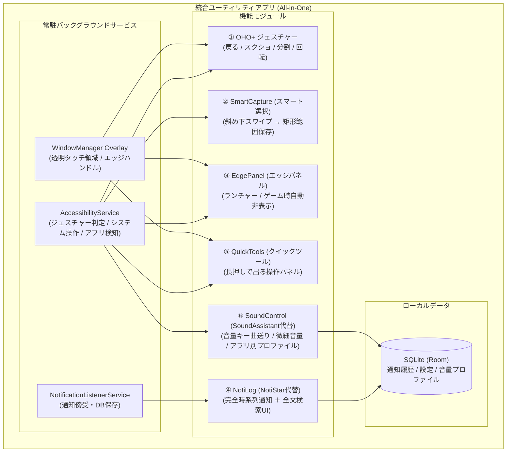

# Galaxy → Pixel 移行要件定義 & 統合ユーティリティアプリ仕様書

本ドキュメントは、Galaxy Z Fold7からPixel（または他社Android）への移行に伴い、Galaxy固有のGood Lock機能や操作感を再現するための要件定義、およびそれを実現する**1つの統合Androidアプリ**の設計仕様書です。

---

## 1. プロジェクト方針

* **目的**: 端末返却・乗り換え後も、長年培ったGalaxyの「親指の操作感」「情報収集スピード」「大画面マルチタスク」を損なわず、Pixel等で同等以上の体験を実現する。
* **開発方針**: 各種機能をバラバラのアプリに分散させず、**「1つの統合常駐ユーティリティアプリ」**として開発する。
  * **メリット**:
    1. 画面端のタッチ判定（OHO+とエッジパネル）の競合・誤爆を完全に防止できる。
    2. 常駐サービス・権限設定（アクセシビリティ、オーバーレイ、通知リスナー）を一元化し、バッテリー消費を最小化できる。
    3. 設定画面を1つのアプリでまとめて管理できる。

---

## 2. 現状分析（Galaxy Z Fold7 実機ADB調査結果）

* **対象端末**: SC-56F (Galaxy Z Fold7 / NTT docomo)
* **調査日**: 2026-10-04

### ① インストール済みGood Lock関連モジュール
| モジュール名 | パッケージ名 | 稼働状態 |
| :--- | :--- | :--- |
| **One Hand Operation +** | `com.samsung.android.sidegesturepad` | **最重要・常駐稼働中** |
| **NotiStar** | `com.samsung.systemui.notilus` | **通知リスナー稼働中**（内部名 Notilus） |
| **NavStar** | `com.samsung.systemui.navillera` | **有効**（ヒント線非表示等の設定、内部名 Navillera） |
| **MultiStar** | `com.samsung.android.multistar` | **有効**（フリーフォーム角ジェスチャー等） |
| **QuickStar** | `com.samsung.android.qstuner` | **有効**（QSグリッド10列設定等） |
| **LockStar** | `com.samsung.android.systemui.lockstar` | **有効**（ロック画面カスタム） |
| **SoundAssistant** | `com.samsung.android.soundassistant` | **統合アプリに取り込み**（マルチサウンド、音量キー操作、微細音量等） |
| **Home Up** | `com.samsung.android.app.homestar` | 一部機能取り込み（エッジ履歴・タスク切り替え支援） |
| **RegiStar** | `com.samsung.android.app.galaxyregistry` | 一部機能取り込み（ボタン長押し操作等） |
| **Routine +** | `com.samsung.android.app.routineplus` | 一部機能取り込み（自動化トリガー） |
| **Theme Park** | `com.samsung.android.themedesigner` | （移行対象外：Pixelテーマ機能を使用） |
| **Camera Assistant** | `com.samsung.android.app.cameraassistant` | **【除外】Pixel標準カメラ機能で十分なため取り込まない** |
| **Good Lock (本体)** | `com.samsung.android.goodlock` | 導入済み |

### ② One Hand Operation +（OHO+）の現在稼働設定
* **左右ハンドル**: 両方有効、透明度 `alpha=0.0`（完全透明・非表示）
* **タッチ領域**: 幅 120px、縦位置中央〜下寄り（Y座標 908〜2067、手元位置）
* **動作オプション**: キーボード表示時に上へ退避 (`moveKeyboard=true`)、カーブアニメーション、バイブレーション有効
* **ジェスチャー割り当て（左右共通）**:
  * **水平スワイプ (→ / ←)**: 戻る (`key_back`)
  * **斜め上スワイプ (↗ / ↖)**: 全画面スクリーンショット (`screen_capture`)
  * **斜め下スワイプ (↘ / ↙)**: **スマート選択（矩形選択して即座に部分保存）** ★実装完了
  * **水平長押しスワイプ**: クイックツール (`group_control_panel`)
  * **斜め上長押しスワイプ**: （未設定・何もしない）
  * **斜め下長押しスワイプ**: 画面自動回転の切り替え (`quick_rotation`)
* **バイブレーション**: 設定画面でON/OFF切り替え可能（触覚フィードバック、長押し成立時に2回目振動）

### ③ ナビゲーション・UI設定
* `navigation_bar_gesture_hint=0`: 最下部のジェスチャーヒント横棒を完全非表示。
* `com.quickcursor`: 画面上部へのアクセス用片手カーソルを併用。

---

## 3. 日常動作・操作感 棚卸し要件一覧

| 操作トリガー（指の動き） | 期待する動作・用途 | 移行先での実現方針 |
| :--- | :--- | :--- |
| **画面端から内側へスワイプ** | **戻る**（日常の主操作） | 自作アプリ（`AccessibilityService.GLOBAL_ACTION_BACK`） |
| **画面端から斜め上へスワイプ** | **全画面スクリーンショット** | 自作アプリ（`GLOBAL_ACTION_TAKE_SCREENSHOT`） |
| **画面端から斜め下へスワイプ** | **スマート選択代替（即時矩形切り抜き保存）** ※Instagramの写真等ピンポイント保存 | 自作アプリ（画面フリーズオーバーレイ＋範囲選択保存） |
| **画面端をスワイプ長押し** | **クイックツール（コントロールパネル）** ※音量、画面明るさ、ライト等の操作 | 自作アプリ（フローティング操作パネル） |
| **画面端から斜め上へ長押し** | **画面分割（2画面マルチタスク）** | 自作アプリ（`GLOBAL_ACTION_SPLIT_SCREEN`） |
| **画面端から斜め下へ長押し** | **画面の自動回転 ON/OFF 切り替え** | 自作アプリ（システム設定変更 API） |
| **画面端のうっすらバーを引く** | **エッジパネル（アプリランチャー）** ※ゲームプレイ中は自動非表示 | 自作アプリ（オーバーレイ＋アプリ判別ロジック） |
| **通知の振り返り・見返し** | **NotiStar代替（完全時系列通知ログ＋検索）** ※グルーピングなし、キーワード全文検索 | 自作アプリ（`NotificationListenerService` ＋ SQLite） |
| **画面の四隅からスワイプ** | **小窓（ポップアップ/Freeform）表示** | 自作アプリ（Freeform Window 起動） |
| **画面最下部** | **ホーム / アプリ履歴** | Android標準ジェスチャー（ヒント線非表示運用） |

---

## 4. 統合アプリ（All-in-One） アーキテクチャ設計

本アプリは、1つのAPK内に以下の **5つの機能モジュール** を内包する統合設計とします。

### モジュール詳細仕様

#### 1. ジェスチャーモジュール（OHO+ 代替）
* **タッチ検出**: 画面両端に透明なオーバーレイを配置。
* **ジェスチャー判定**: 水平・斜め上・斜め下、および「長押し（ホールド）」を判定。
* **キーボード連動**: IME（ソフトウェアキーボード）表示時は、ジェスチャー有効領域を自動で上部にシフト。

#### 2. スマート切り抜きモジュール（SmartCapture）
* **起動**: 画面端から「斜め下スワイプ」。
* **挙動**:
  1. `AccessibilityService.takeScreenshot()` でバックグラウンドキャプチャを取得。
  2. 画面上に静止画オーバーレイを表示（画面が一時停止した状態になる）。
  3. ユーザーがInstagramの写真などの保存したい領域を指で矩形ドラッグ。
  4. 選択領域のみをBitmapクロップし、端末の画像ストレージに即時保存。
  5. オーバーレイを閉じる。

#### 3. エッジパネルモジュール（EdgePanel）
* **UI**: 画面端（上部）にうっすら半透明のインジケーター（タブ）を表示。
* **挙動**: 内側スワイプまたはタップで、登録したアプリ一覧や2画面ペアアプリを展開。
* **ゲーム自動非表示機能**:
  * `AccessibilityService` がフォアグラウンドアプリの変更を検知。
  * アプリのカテゴリが `CATEGORY_GAME` である場合、または手動ブラックリストに含まれる場合は、**ハンドルを完全非表示（タッチ無効化）** にする。

#### 4. 完全時系列通知ログモジュール（NotiLog / NotiStar代替）
* **データ収集**: `NotificationListenerService` により、全アプリの通知を受信してRoom DBに保存。
* **一覧UI**:
  * アプリごとの束ね（グルーピング）は行わず、**新着順に1件ずつフラットに時系列表示**。
  * タップで当該通知の `PendingIntent` を実行（通知先画面を即座に開く）。
* **検索UI**:
  * 画面上部に検索バーを常設。
  * 「通知タイトル」「通知本文」「アプリ名」のインクリメンタル部分一致検索。
* **呼び出し導線**: エッジパネルのショートカット、またはジェスチャーから一発で表示可能。

#### 5. クイックツールモジュール（QuickTools）
* **起動**: 画面端から「水平長押しスワイプ」。
* **UI**: 画面端からポップアップする小型コントロールパネル（メディア音量、画面明るさ、フラッシュライト、画面自動回転など）。

#### 6. 音量・メディア制御モジュール（SoundControl / SoundAssistant代替）
* **音量キー長押しで曲送り/曲戻し**:
  * `AccessibilityService` の `onKeyEvent` で音量キーを検知。
  * 音量Up長押しで次曲スキップ (`KEYCODE_MEDIA_NEXT`)、音量Down長押しで前曲スキップ (`KEYCODE_MEDIA_PREVIOUS`)。
* **微細な音量コントロール（ステップ細分化）**:
  * Android標準の15段階の粗い刻みに対し、1%単位（100段階）の微細なボリューム変更に対応。
* **アプリごとの音量プロファイル自動適用**:
  * `AccessibilityService` が起動アプリ（前面アプリ）を検知。
  * 「ゲーム起動時は音量30%」「動画アプリ起動時は音量60%」など、アプリごとに設定した音量に自動で即座に切り替え。
* **マルチ音量パネル**:
  * クイックツールおよびエッジパネルから、メディア・アラーム・通話・通知の各音量を一括調整可能。

---

## 5. 必要な権限・システム要件

| 権限 / コンポーネント | 用途 |
| :--- | :--- |
| `BIND_ACCESSIBILITY_SERVICE` | 戻る・スクショ・分割画面の実行、前面アプリ（ゲーム等）検知、画面キャプチャ取得 |
| `BIND_NOTIFICATION_LISTENER_SERVICE` | NotiStar代替としての通知履歴収集 |
| `SYSTEM_ALERT_WINDOW` | 画面端のタッチ受付領域、エッジパネル、切り抜きUIのフローティング表示 |
| `WRITE_SETTINGS` | 画面の自動回転ON/OFFの直接切り替え |
| `POST_NOTIFICATIONS` | 常駐フォアグラウンドサービスの維持 |

---

## 6. 実装・開発ロードマップ & 達成状況

1. **Phase 1: プロジェクト基盤 & コアジェスチャー（OHO+）** 【完了・実機検証済み】
   * Androidプロジェクト作成（Kotlin + Jetpack Compose）。
   * `AccessibilityService` 最上位オーバーレイ（`TYPE_ACCESSIBILITY_OVERLAY`）でOSジェスチャーを完全掌握。
   * 水平スワイプ（戻る）、斜め上スワイプ（全画面スクショ）、斜め下長押し（画面自動回転）。
   * 触覚フィードバック（設定画面でON/OFF、長押し350ms成立時の2回目振動）。
   * キーボード自動退避（`moveKeyboard=true`）：キーボード展開時にハンドルが上に逃げ、バックスペース等への干渉ゼロ。

2. **Phase 2: スマート切り抜き（SmartCapture / Instagram写真即保存）** 【完了・実機検証済み】
   * `takeScreenshot` 連携による画面フリーズ静止画オーバーレイ表示。
   * 矩形選択、ドラッグ移動、四隅・4辺リサイズ。
   * 画面端マグネティックスナップ（吸着＋ハプティック振動）。
   * ステータスバー・パンチホール貫通（`LAYOUT_IN_DISPLAY_CUTOUT_MODE_SHORT_EDGES`）による画面の歪み・ズレ完全解消。
   * デバッグ青色表示の非写り込み。
   * 写真ファイル（PNG）として `Pictures/GoodPixel` への高画質即時保存。

3. **Phase 3: エッジパネル（Edge Panel & ゲーム検知）** 【完了・実機検証済み】
   * 画面右端上部にうっすら常駐するエッジハンドル（タブ）。
   * スライドインする縦型ランチャーパネル。
   * **アプリ一覧編集機能**: 端末内の全アプリ（`QUERY_ALL_PACKAGES`）からお好みで追加・削除・並び替え（最大12個）。
   * ゲーム自動非表示: ゲーム起動時はエッジタブを自動で完全非表示（`GONE`）にし、プレイ中の誤爆をゼロ化。

4. **Phase 4: NotiStar代替（NotiLog / 通知時系列ログ & 全文検索）** 【完了・実機検証済み】
   * `GoodNotificationListenerService` により全アプリの通知を受信してSQLiteに永続化。
   * アプリごとにまとめず、新着順に1件ずつフラットに時系列表示。
   * インクリメンタル全文検索（アプリ名・タイトル・本文の部分一致）。
   * タップで `PendingIntent` を発火して該当アプリの通知先画面へ直接ジャンプ。
   * 履歴の個別削除・全消去。

5. **Phase 5: クイックツール（Quick Tools） & 統合設定画面** 【完了・実機検証済み】
   * 水平長押しスワイプで呼び出せるフローティング操作パネル。
   * メディア音量スライダー（画面から親指で直接調整）。
   * 画面の明るさスライダー、自動回転、フラッシュライト（懐中電灯）。
   * NotiStar、スマート選択、スクショへのショートカット。
   * 統合設定画面（権限確認、各種機能の動作テスト、エッジアプリ編集）。
